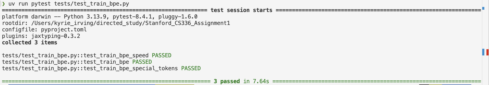
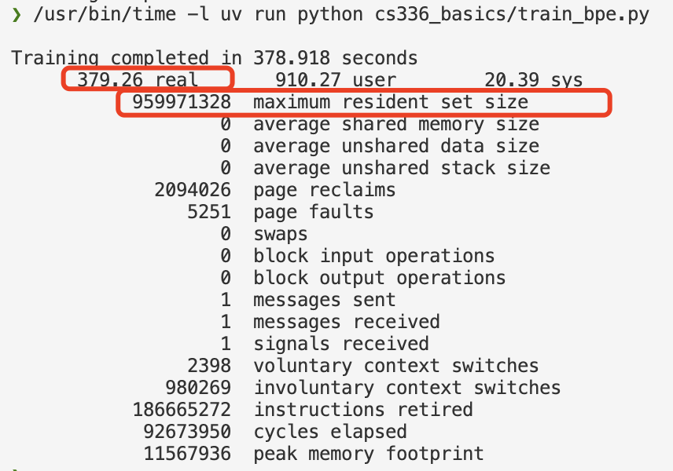

This file will later document my coding results.
## Test BPE traning function

I impelemented 3 versions so far
- naive
- multiprocessing on pre-tokenization
- Optimize BPE pair count updates to avoid full recomputation
## time and memory took by training BPE on tinystories(2.1G), vocab_size=10000
