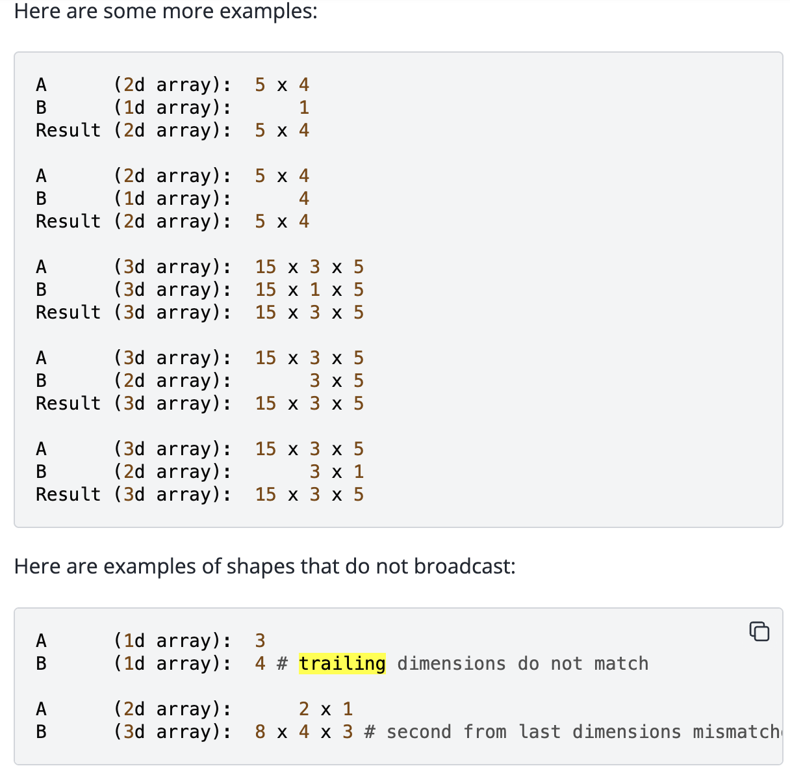

## Tokenizer
A language model places a probability distribution over sequences of tokens (usually represented by integer indices). So we need a procedure that encodes strings into tokens. Also a procedure decodes tokens back to string.
## Unicode
Unicode is a text encoding standard that maps characters to integer code points. For example, the character “s” has the code point 115 (typically notated as U+0073, where U+ is a conventional prefix and 0073 is 115 in hexadecimal), and the character “牛” has the code point 29275.

### why not train tokenizer directly on unicode (character-based tokenizer)
- Unicode has 154,998 characters, 155k vocabulary size. Too **large**. GPT-2 has around 50K
- **sparse**, since many characters are quite rare, which makes model hard to learn reliably

Instead, we use **UTF-8**, the dominant character encoding for the web, representing any Unicode character (letters, emojis, symbols) using 1 to 4 bytes

By converting our Unicode codepoints into a sequence of bytes (e.g., via the UTF-8 encoding), we are essentially taking a sequence of codepoints (integers in the range 0 to 154,997) and transforming it into a sequence of byte values (integers in the range 0 to 255). 256-length byte vocabulary is much more manageable.

### Other Tokenizer
- **word tokenizer**: Vocabulary size is # of distinct segments in the training data. New words haven't seen during training will experience out-of-vocabulary and get \<unk\> token
- **byte-level tokenizer**: Vocabulary size is 256, compression ratio = # token / # bytes = 1. Compression ratio stands for how many bytes does a token cover on average. Compression ratio low means, longger sequence length, more computation in attention layer.

## Subword Tokenizer(Byte-pair tokenizer)
midpoint between word-level and byte-level tokenizer.

### Special token
some strings as special token should never split into multiple tokens, such as \<|endoftext|> which is represent boundaries between document.

### Algorithm
- Initialize vocabulary
- pre-tokenization
- Merge

## mixed-precision training
For parameters and optimizers state use float32, bf16 for other.

## Transformer architecture

# Numpy/Pytorch
When accessing the contents of a tensor via indexing, PyTorch follows Numpy behaviors that basic indexing returns views, while advanced indexing returns a copy. Assignment via either basic or advanced indexing is in-place. See more examples in Numpy indexing documentation.
## Broadcast
The term broadcasting describes how NumPy treats arrays with different shapes during arithmetic operations. 
**Rules**
When operating on two arrays, NumPy compares their shapes element-wise. It starts with the trailing (i.e. rightmost) dimension and works its way left. Two dimensions are compatible when
- they are equal, or
- one of them is 1.


## Advanced slicing
### Integer Array Indexing
#### pairwise
returns a copy of the data (contrast with basic slicing that returns a view).

Slice with two or more tensor/ndarry. When the index consists of as many integer arrays as dimensions of the array being indexed,
```
index_a = torch.tensor([0, 1])
index_b = torch.tensor([1, 0]) # if we set index_b = torch.tensor([1]), broadcast happen here first
index_c = torch.tensor([2, 1])
tensor_3d_indexed = tensor_3d[index_a, index_b, index_c]
```
This result will be shape (2,). `Reulst tensor = tensor_3d[0,1,2][1,0,1]`
#### Partially index, one tensor/ndarray as argument.
The shape of the resultant array will be the concatenation of the shape of the index array (or the shape that all the index arrays were broadcast to) with the shape of any unused dimensions (those not indexed) in the array being indexed.

Example 1, dimension of index array smaller than the array being indexed
```
tensor_2d = torch.arange(30).reshape(5, 6)
index_tensor2 = torch.tensor([[0, 2, 4],[1,3,4], [1, 2, 3]])
a = tensor_2d[index_tensor2]
final shape will be (3,3,6)
```
Example 2
```
A = torch.arange(2*3*4).reshape(2,3,4)   # (2,3,4)
idx = torch.tensor([[0,1],
                    [1,0]])             # (2,2)

B = A[idx]
print(B.shape)  # (2,2,3,4)
```

#### Boolean Index

## state_dict
`state_dict` in PyTorch is a Python dictionary object that maps each layer of a neural network or optimizer to its learnable parameters (weights and biases) and registered buffers

## torch.chunk
Attempts to split a tensor into the specified number of chunks. Each chunk is a view of the input tensor.


